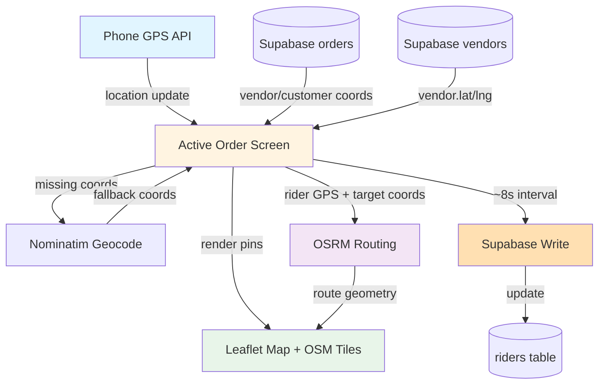

# Rider Map Tracking — Architecture

Plain-language architecture for the ActiveOrder map system. Covers how rider/vendor/customer pins are sourced, how routes are calculated, and how location sync works.

## Stack

- **Leaflet** — map UI
- **OpenStreetMap (OSM)** — tile provider
- **OSRM** — driving route calculations
- **Nominatim** — geocoding fallback only (when coords missing)
- **Supabase** — stores order/vendor coords; writes rider location updates

**Not used:** Google Maps, Mapbox.

## Rider Pin (live GPS)

**Source:** Browser Geolocation API

**When tracked:**
- Active Order screen (always)
- Home screen (only when rider is online, to warm/sync position)

**Accuracy settings:**
- `enableHighAccuracy: true`
- `maximumAge: 0` on first read (fresh position)

**Accuracy gates:**
- **Reject:** >~3 km (too inaccurate)
- **Weak:** ~400 m – 3 km (display warning)
- **Trusted:** better than ~400 m

**What it is NOT:**
- Not from onboarding (onboarding never sets map coords)
- Not read back from DB for routing (always use live GPS as route start point)

**DB writes:**
- Every ~8 seconds to `riders.current_lat`, `riders.current_lng`, `riders.location_updated_at`
- Enables future customer live-tracking UI (not built yet)

## Vendor Pin

**Source ladder:**
1. `vendor.latitude` / `vendor.longitude` (if present)
2. Nominatim geocode fallback (if coords missing)

## Customer Pin

**Source ladder (first found wins):**
1. `order.delivery_lat` / `order.delivery_lng` (if present)
2. Parse Maps link or bare coords from `order.delivery_address`
3. Nominatim geocode (Ghana-biased) of `delivery_address`

## Default Map Center

**Ho, Ghana** — never Accra.

## Routing

**Provider:** OSRM

**Route endpoints:**
- **Before pickup:** rider GPS → vendor pin
- **After pickup:** rider GPS → customer pin

**Recalculation triggers:**
- Rider is **~150 m off route**
- Cooldown to prevent route-calc spam

**Arrival threshold:** **~100 m** from target

## What This Is NOT

- **No Google/Mapbox** — only OSM + OSRM + Nominatim
- **No customer live-tracking UI yet** — DB writes prepare for it, but customer app doesn't show rider position yet
- **Onboarding never sets rider map coords** — map coords come from Active Order / Home GPS only

## Flow Diagram

## Summary

Maps are **Leaflet + OSM** for UI, **OSRM** for routes, **Nominatim** as fallback geocoder. Rider position comes from **live browser GPS** (high accuracy, fresh reads), not from DB. Location updates write to `riders` table every ~8s to support future customer tracking. Vendor pin uses DB coords or geocode; customer pin tries order coords, then parses delivery address for coords/links, then geocodes. Default center is **Ho**. Routes recalc when off-track; arrival at ~100 m.
